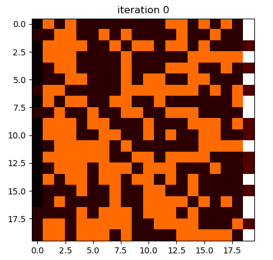
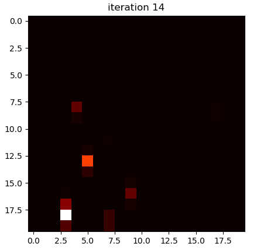
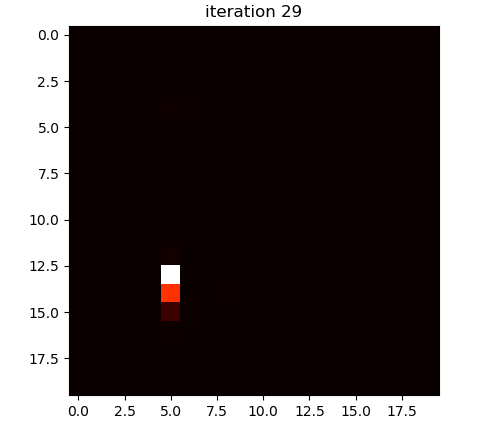
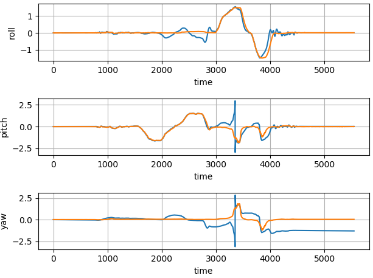
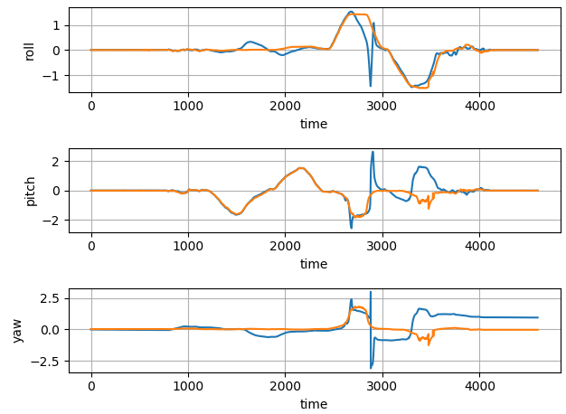
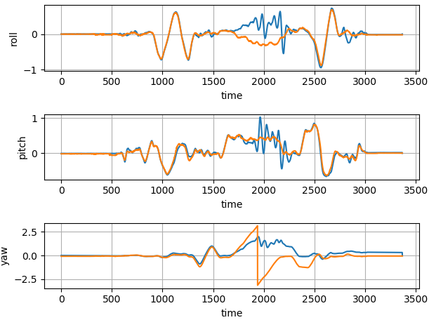
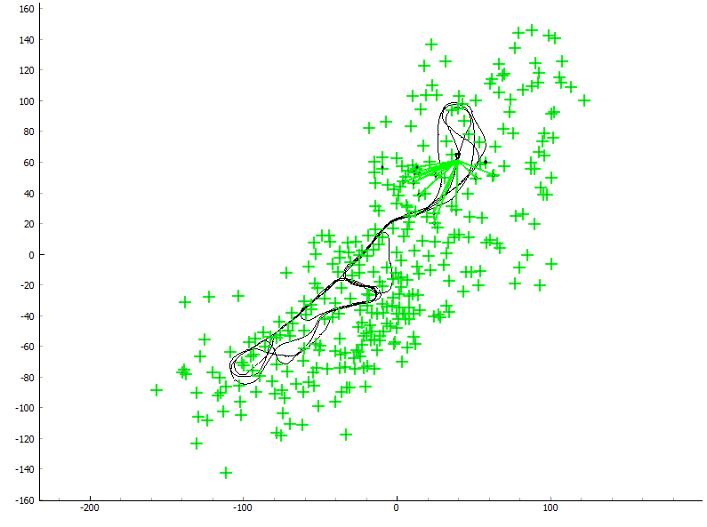
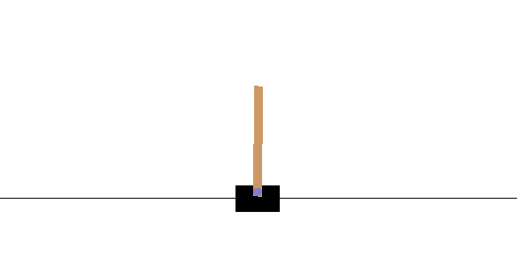

# learning-in-robotics

**Prerequisites**

numpy
math
PyQt5
pyqtgraph
matplotlib
scipy
pytorch
gym

## project 1

2D grid Bayes filter. Cell characeterized by a color (0 or 1) and noisy color and odometry sensors.

## project 2

Unscented Kalman Filter for rotation estimation using quaternions. Result in roll, pitch, yaw where orange is estimated and blue is actual.

## project 3

SLAM on Victoria park dataset using Extended Kalman Filter to combine predicted dynamics from wheel encoder and periodic gps measurements of a vehicle driving around observing trees. Each tree detected from laser maeasurement is added to the state to create a map. Mahlanobis distance is used to determine if a tree is already apart of the map.

## project 4
Policy gradient reinforcement learning on Open AI gym cartpole.

